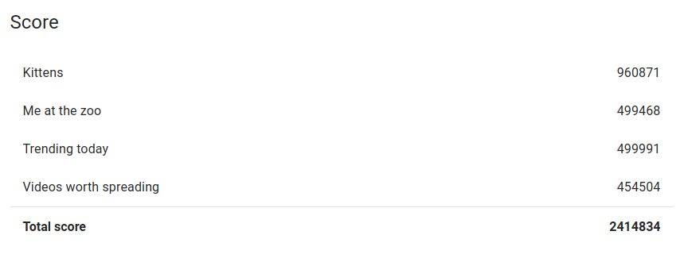

This is algorithm of team `Gildas2000` for Google's HashCode 2017,
Qualification Round (which we didn't pass).

We've had 2 approachs, the first is to start by selecting the caches
one after the other, selecting the best vids for each. All caches are
filled in sequence and we never go back on our decisions, which make
it very time efficient (`kittens` is less than 2 minutes. This is the
one that gave us the best scores (on `kittens` at least).

The second one is to sort the predictions in term of _impact_ on
latency and to try to solve the biggest demands by adding the video
into a cache. It is necessary to go back on some decisions frequently
so this algorithm is much longer to run.

The 2 last commits during the contest are `45ecd08` and `91fa879`, our
score at that point was `1584833`. The rest was added during the
_Extended Round_, the final score is `2414834`.

Thanks to @Ripounet for the input/output helpers ;)
